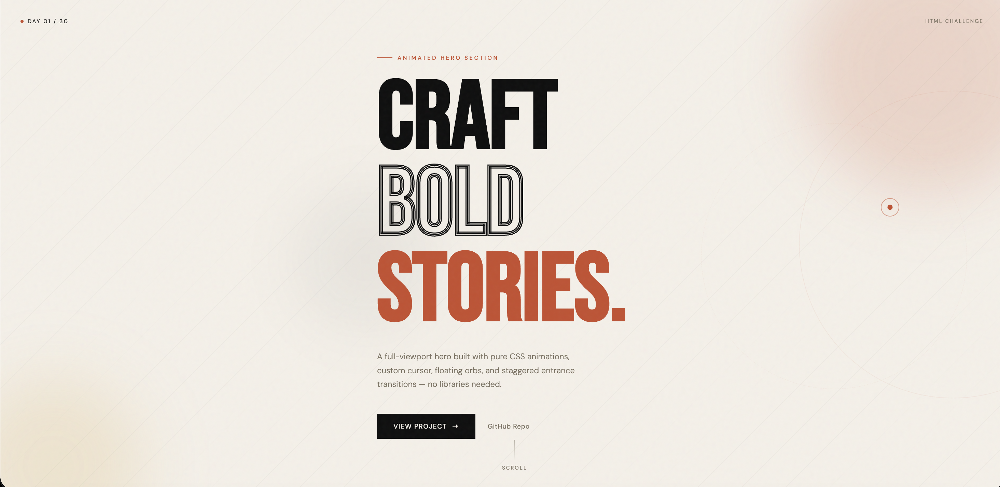

# Day 01 — Animated Hero Section

## Challenge

Build a full-viewport hero with a headline, subtext, a CTA button, and CSS keyframe background animations.

## What I Built

- Full-viewport hero using `100vh`
- Floating animated orbs with `blur` + `@keyframes drift`
- Diagonal stripe texture overlay
- Rotating decorative ring with `animation: spin`
- Staggered entrance animations on all content elements
- Custom CSS cursor with smooth JS ring-follow effect
- Animated grain/noise texture overlay
- CTA button with sliding fill on hover
- Scroll indicator with pulsing line

## Concepts Used

- CSS `@keyframes` (drift, spin, fadeUp, pulse, grain)
- `animation-delay` for staggered reveals
- CSS custom properties (`--variables`)
- `backdrop-filter`, `filter: blur()`
- Viewport units (`vh`, `vw`)
- Flexbox centering
- CSS pseudo-elements (`::before`, `::after`)
- `-webkit-text-stroke` for outline text
- `requestAnimationFrame` for smooth cursor ring
- `overflow: hidden` clipping

## Time Taken

~60 minutes

## What I Learned

Using `animation-delay` with staggered values creates a polished page-load sequence. The custom cursor uses `requestAnimationFrame` with lerp (linear interpolation) so the ring smoothly trails behind the dot.

---

[⬅️ Back to Main README](../README.md) · [Day 02 ➡️](../Day-02-Responsive-Navbar/)