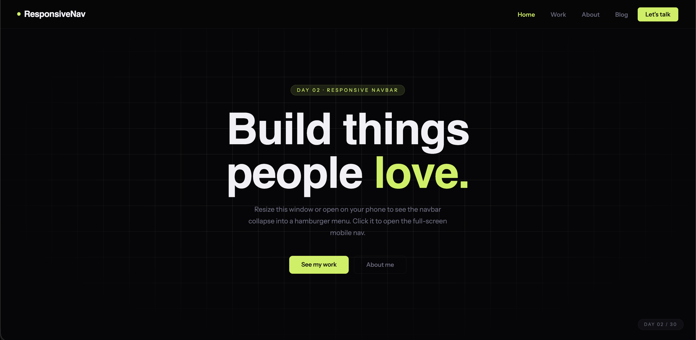

# Day 02 — Responsive Navbar

## Challenge

Create a sticky navbar that collapses into a hamburger menu on mobile using HTML, CSS, and a little JavaScript.

## What I Built

- Sticky navbar fixed to the top using `position: fixed`
- Frosted glass effect using `backdrop-filter: blur()`
- Navbar darkens on scroll using a `.scrolled` class added by JS
- Desktop nav links with hover effects
- Hamburger button (3 lines → X animation on click)
- Full-screen mobile menu with staggered link entrance
- Active link highlighting based on scroll position
- Closes on link click, Escape key, or outside tap
- Body scroll locked when mobile menu is open
- 1 demo page sections to test sticky behaviour

## Concepts Used

- `position: fixed` — keeps navbar on screen while scrolling
- `backdrop-filter: blur()` — frosted glass navbar background
- CSS `transition` — smooth animations on hamburger lines
- `transform: rotate()` — lines animate into an X
- `classList.toggle()` — JS adds/removes CSS classes
- `window.addEventListener('scroll')` — detect scroll position
- `document.body.style.overflow = 'hidden'` — lock body scroll
- `opacity` + `translateY` — mobile menu fade-in animation
- `animation-delay` — stagger mobile link entrances
- `@media (max-width: 768px)` — show/hide elements per screen size

## Time Taken

~60 minutes

## What I Learned

Using `classList.toggle('open')` is the cleanest way to handle open/close states — one class controls everything. The hamburger animation works by rotating line 1 by +45°, hiding line 2, and rotating line 3 by -45°, which forms a perfect X shape.

---

[⬅️ Day 01](../Day-01-Animated-Hero-Section/) · [Back to Main README](../README.md) · [Day 03 ➡️](../Day-03-CSS-Card-Flip/)