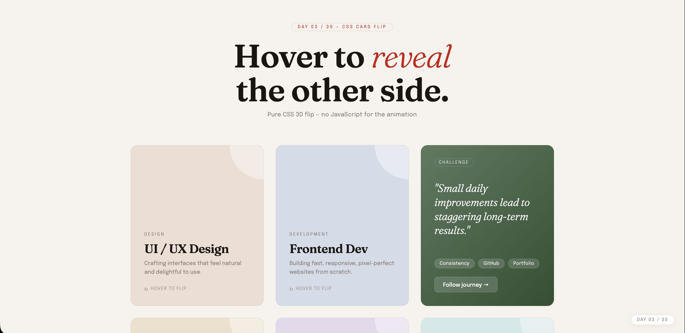

# Day 03 — CSS Card Flip

## Challenge

Design a product or profile card that flips 180° on hover, revealing a back face with extra info — using pure CSS 3D transforms.

## What I Built

- 6 flip cards in a responsive CSS Grid layout
- Pure CSS 3D flip animation on hover (no JS for animation!)
- Each card has a unique front colour and matching back gradient
- Back face shows a quote, skill chips, and a CTA button
- Tap-to-flip support on mobile via JS class toggle
- Staggered fade-up entrance animation on page load
- Fully responsive — single column on mobile

## Concepts Used

- `perspective: 1000px` — creates the 3D depth effect
- `transform-style: preserve-3d` — children live in 3D space
- `backface-visibility: hidden` — hides the face pointing away
- `transform: rotateY(180deg)` — the flip itself
- `transition` — smooth 0.7s flip animation
- CSS Grid `auto-fit` + `minmax()` — responsive card grid
- `position: absolute; inset: 0` — front & back overlap perfectly
- `classList.toggle()` — tap to flip on mobile

## Time Taken

~55 minutes

## What I Learned

The trick to card flip is that **both faces are stacked on top of each other** using `position: absolute`. The back face starts pre-rotated at `rotateY(180deg)` so it's hidden. When the card rotates 180°, the front hides and the back becomes visible. `backface-visibility: hidden` is the key — without it, you'd see a mirror image through the card.

---

[⬅️ Day 02](../Day-02-Responsive-Navbar/) · [Back to Main README](../README.md) · [Day 04 ➡️](../Day-04-Custom-Range-Slider/)