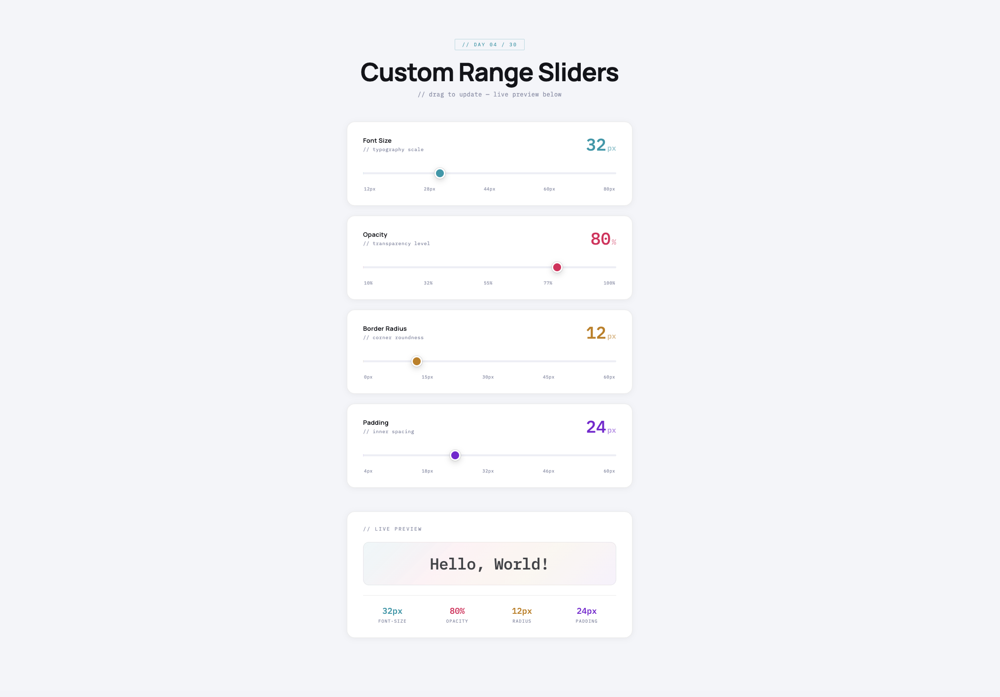

# Day 04 — Custom Range Slider

## Challenge

Style a native `<input type="range">` into a beautiful, branded slider with a live value display via JavaScript.

## What I Built

- 4 fully custom range sliders — Font Size, Opacity, Border Radius, Padding
- Each slider has its own accent colour (cyan, pink, amber, violet)
- Live big-number value display updates as you drag
- Coloured fill bar grows with the slider position
- Live preview box at the bottom — all 4 sliders affect it in real time
- Stats row shows all 4 current values at a glance
- Tick marks showing min/max reference points
- Thumb scales up on drag with `transform: scale(1.2)`
- Fully responsive — works on mobile touch too

## Concepts Used

- `-webkit-appearance: none` — removes browser default styling
- `::-webkit-slider-thumb` — styles the draggable circle
- `::-moz-range-thumb` — Firefox version of the thumb
- `oninput` event — fires every time the slider moves
- CSS variables (`--cyan`, `--pink` etc.) — one source of truth for colours
- `element.style.propertyName` — JS changing CSS live
- Percentage calculation for fill bar width
- `parseInt()` — converts string value to a number
- `position: absolute` — fill bar sits behind the input

## Time Taken

~65 minutes

## What I Learned

The native `<input type="range">` looks different in every browser. The trick to styling it is `-webkit-appearance: none` which strips all default styles, then you rebuild it from scratch using `::-webkit-slider-thumb` for the circle and the `background` property for the track. The fill bar is a separate `
` positioned behind the input — JS calculates its width as a percentage of how far the slider has moved.

---

[⬅️ Day 03](../Day-03-CSS-Card-Flip/) · [Back to Main README](../README.md) · [Day 05 ➡️](../Day-05-Dark-Light-Mode-Toggle/)