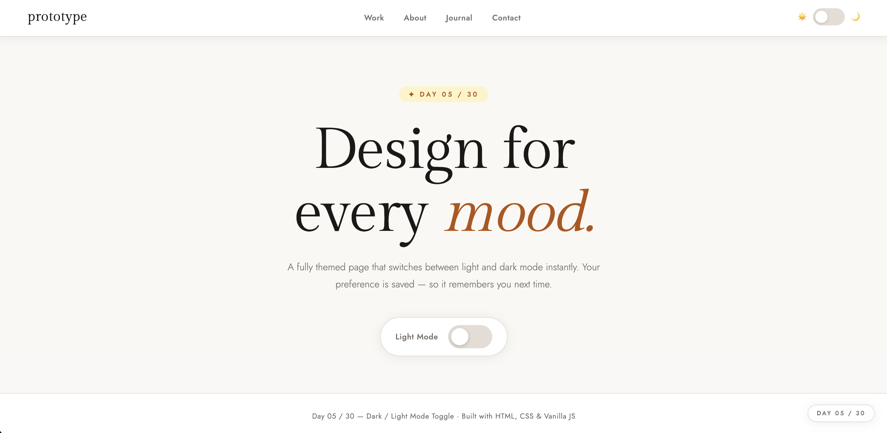

# Day 05 — Dark / Light Mode Toggle

 [Preview](PreviewDark.png)

## Challenge

Implement a theme switcher using a CSS class on `<body>` toggled by JS, persisted in localStorage.

## What I Built

- Full page light & dark theme with smooth animated transition
- CSS variables (`--bg`, `--text`, `--accent` etc.) power the entire theme
- `data-theme` attribute on `<html>` switches the active theme
- Small toggle in the navbar + a big hero toggle — both in sync
- `localStorage` saves your preference so it survives page reloads
- `transition` on `*` selector makes every element fade smoothly
- Keyboard accessible toggle (Enter / Space keys work)
- `aria-checked` attribute updates for screen reader support
- Live label updates: "Light Mode" ↔ "Dark Mode"
- Demo content: cards, code block, article steps — all themed

## Concepts Used

- CSS custom properties (`--variable`) on `:root` and `[data-theme]`
- `[data-theme="dark"]` attribute selector in CSS
- `document.documentElement` — selects the `<html>` element
- `element.setAttribute('data-theme', 'dark')` — switches theme
- `localStorage.setItem()` / `localStorage.getItem()` — persistence
- `*` universal selector with `transition` — smooth theme switch
- `aria-checked` — accessibility for toggle switch role

## Time Taken

~120 minutes

## What I Learned

The entire theme system is just **CSS variables + one HTML attribute**. When `data-theme="dark"` is on the `<html>` element, CSS automatically picks up the dark variable overrides — no JavaScript touches any individual element. Adding `transition` to `*` (every element) with a 0.4s ease makes the whole page fade beautifully between themes instead of snapping.

---

[⬅️ Day 04](../Day-04-Custom-Range-Slider/) · [Back to Main README](../README.md) · [Day 06 ➡️](../Day-06-Typewriter-Text-Effect/)