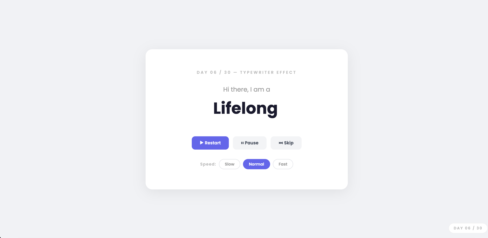

# Day 06 — Typewriter Text Effect

## Challenge

Build a typewriter animation that types words one character at a time, deletes them, and loops — with a blinking cursor.

## What I Built

- Typewriter that cycles through 5 words automatically
- Blinking cursor using CSS `animation`
- **Restart** button — resets back to the first word
- **Pause / Resume** button — stops and continues the animation
- **Skip** button — jumps to the next word
- **Speed chips** — Slow / Normal / Fast
- Clean single card layout, fully responsive

## Concepts Used

- `string.slice(0, n)` — shows only the first n characters of a string
- `element.textContent` — updates the text on screen
- `setTimeout()` — schedules the next character after a delay
- `deleting` flag — a boolean that switches between typing and deleting
- `wordIndex % words.length` — loops back to the first word after the last
- CSS `animation: blink 1s step-end infinite` — the cursor blink effect
- `step-end` — makes the cursor snap on/off instantly (not fade)

## Time Taken

~45 minutes

## What I Learned

The whole typewriter trick is just `string.slice(0, charIndex)`. Every tick, you increase `charIndex` by 1 and re-render the text. For deleting, you decrease it. A simple `deleting` boolean switches between the two modes. The `%` operator makes the word list loop forever without any extra logic.

---

[⬅️ Day 05](../Day-05-Dark-Light-Mode-Toggle/) · [Back to Main README](../README.md) · [Day 07 ➡️](../Day-07-Responsive-Image-Gallery/)