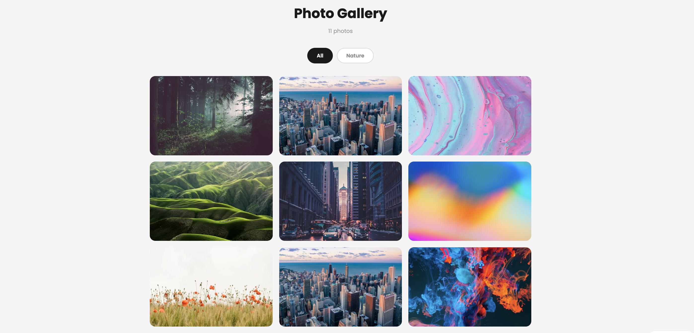
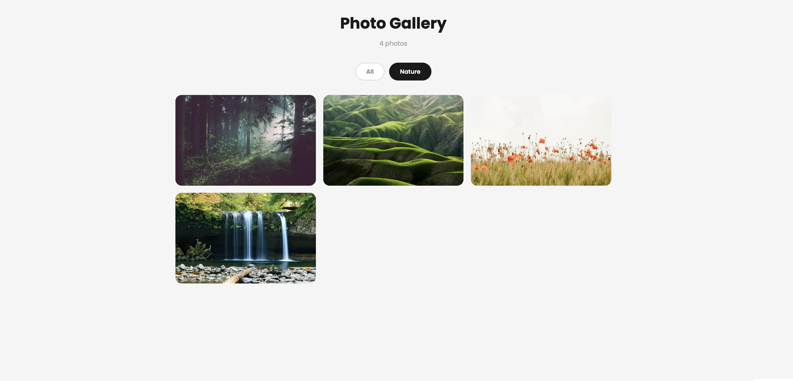

# Day 07 — Responsive Image Gallery

## Challenge

Build a responsive image gallery with category filtering and a lightbox viewer.

## What I Built

- 10 photo cards in a **3-column CSS Grid**
- **Filter buttons** — All / Nature 
- **Hover effect** — card lifts up, title label fades in
- **Lightbox** — click any card to open fullscreen view
- Prev / Next buttons + keyboard arrow key navigation
- Click backdrop or press Escape to close lightbox
- Responsive — 3 cols → 2 cols → 1 col on mobile
- Live photo count updates when filter changes

## Concepts Used

- `display: grid` + `grid-template-columns: repeat(3, 1fr)` — equal 3-column grid
- `@media` queries — changes columns on smaller screens
- `opacity: 0` → `opacity: 1` on hover — label fade in
- `transform: translateY(-4px)` on hover — card lift effect
- `position: fixed; inset: 0` — lightbox covers full screen
- `pointer-events: none` / `all` — shows/hides lightbox without removing from DOM
- `e.target === this` — close when clicking the backdrop
- `% modulo` — loops prev/next through the array
- `document.body.style.overflow = 'hidden'` — disables scroll when lightbox is open

## Time Taken

~50 minutes

## What I Learned

`grid-template-columns: repeat(3, 1fr)` creates 3 equal columns automatically. `1fr` means "1 fraction of the available space." The lightbox trick is simple — keep it in the HTML always, but use `opacity: 0; pointer-events: none` to hide it, then switch to `opacity: 1; pointer-events: all` when a card is clicked.

---

[⬅️ Day 06](../Day-06-Typewriter-Text-Effect/) · [Back to Main README](../README.md) · [Day 08 ➡️](../Day-08-Interactive-Pricing-Table/)