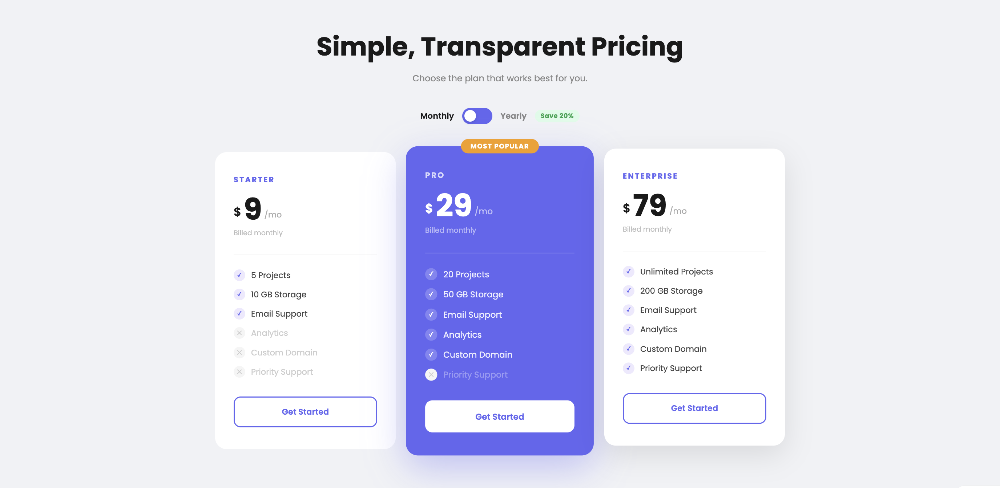

# Day 08 — Interactive Pricing Table

## Challenge

Build a pricing table with three plans and a monthly/yearly billing toggle that updates the prices.

## What I Built

- 3 pricing cards — Starter / Pro / Enterprise
- **Monthly ↔ Yearly toggle** that switches prices instantly (~20% off yearly)
- Middle card highlighted as "Most Popular" with a badge
- Feature list with ✓ tick and ✕ cross icons
- Hover lift effect on all cards
- "Billed monthly / annually" text updates with the toggle
- Fully responsive — stacks to 1 column on mobile

## Concepts Used

- `CSS Grid` — `repeat(3, 1fr)` for the 3-column layout
- `position: relative` + `position: absolute` — "Most Popular" badge sits above the card
- `transform: scale(1.04)` — popular card is slightly larger than the others
- `border: 2px solid transparent` — invisible border that prevents layout shift on hover
- `transition` — smooth price text changes and hover effects
- `classList.toggle('active', condition)` — adds/removes class based on a boolean
- `element.textContent` — updates price number and billing text
- JavaScript object with two arrays — `prices.monthly` and `prices.yearly`

## Time Taken

~50 minutes

## What I Learned

Storing prices in a JS object (`{ monthly: [], yearly: [] }`) makes the toggle very simple — you just pick which array to read from. `classList.toggle('class', boolean)` is cleaner than an if/else for adding or removing classes based on a true/false value.

---

[⬅️ Day 07](../Day-07-Responsive-Image-Gallery/) · [Back to Main README](../README.md) · [Day 09 ➡️](../Day-09-Drag-Drop-Todo-List/)