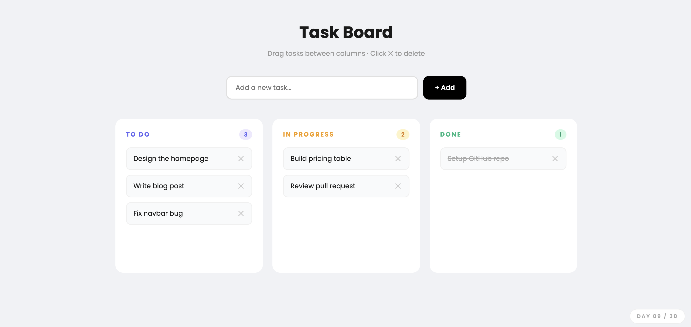

# Day 09 — Drag & Drop Todo List

## Challenge

Build a Kanban-style task board where you can drag tasks between columns.

## What I Built

- 3 columns — **To Do / In Progress / Done**
- **Drag & drop** tasks between any column
- **Add task** with input field (Enter key or button)
- **Delete** any task with the ✕ button
- Column counts update live as tasks move
- Done column shows tasks with strikethrough text
- Column highlights purple when you drag over it
- Task tilts slightly while being dragged
- Pre-loaded with sample tasks
- Responsive — stacks to 1 column on mobile

## Concepts Used

- `draggable="true"` — makes an element draggable
- `dragstart` event — fires when dragging begins, stores which task is moving
- `dragover` event — fires while hovering over a drop zone (must call `e.preventDefault()` to allow drop)
- `drop` event — fires when you release the task, moves it to new column
- `dragleave` event — removes highlight when cursor leaves the column
- `array.splice(idx, 1)` — removes 1 item from an array at index `idx`
- `array.push(text)` — adds item to end of another array
- `array.unshift(text)` — adds new task to the top of the list
- `render()` function — rebuilds the entire UI from the data (one source of truth)

## Time Taken

~55 minutes

## What I Learned

The key to drag & drop is 4 events: `dragstart` (remember what's being dragged), `dragover` (allow the drop with `e.preventDefault()`), `dragleave` (remove highlight), and `drop` (move the item). Storing all data in a JS object and calling one `render()` function every time keeps the code clean — you never touch the DOM directly, you just update the data and re-render.

---

[⬅️ Day 08](../Day-08-Interactive-Pricing-Table/) · [Back to Main README](../README.md) · [Day 10 ➡️](../Day-10-Animated-CSS-Loader-Pack/)