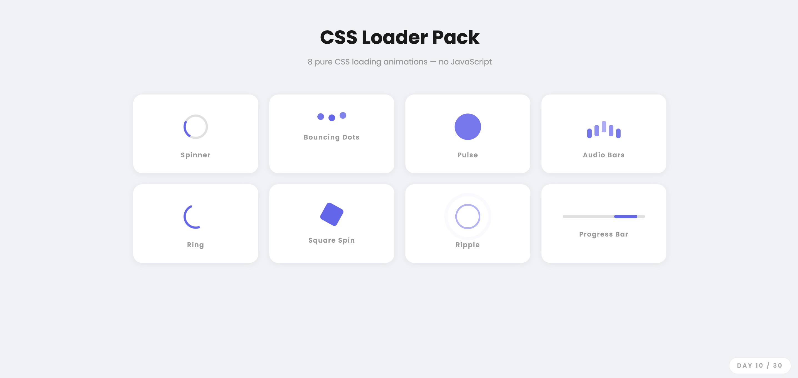

# Day 10 — Animated CSS Loader Pack

## 🎯 Challenge

Build a collection of loading animations using only CSS — no JavaScript at all.

## What I Built

8 pure CSS loaders displayed in a responsive grid:

| # | Loader | Key CSS trick |
|---|--------|---------------|
| 1 | Spinner | `border-top-color` + `rotate(360deg)` |
| 2 | Bouncing Dots | `translateY` alternate + `animation-delay` |
| 3 | Pulse | `scale` + `opacity` |
| 4 | Audio Bars | `scaleY` alternate + staggered delays |
| 5 | Ring | Two-sided `border-color` + spin |
| 6 | Square Spin | `rotate` + `scale` together |
| 7 | Ripple | `::before` / `::after` + `scale` + `opacity` |
| 8 | Progress Bar | `width` + `margin-left` moving across |

## Concepts Used

- `@keyframes` — defines the animation steps
- `animation: name duration timing iteration` — applies the animation
- `animation-delay` — staggers each dot/bar so they don't all move together
- `animation-direction: alternate` — plays forwards then backwards (bounce effect)
- `transform: rotate()` — spins elements
- `transform: scale()` — grows and shrinks elements
- `transform: translateY()` — moves elements up and down
- `::before` and `::after` — creates two ripple rings from one element (no extra HTML!)
- `border-top-color` — makes only one side of a circle border coloured (spinner trick)

## Time Taken

~40 minutes

## What I Learned

All CSS animations use the same pattern: define the motion in `@keyframes`, then apply it with `animation`. The `alternate` direction value makes an animation play forward then backward automatically — perfect for bouncing. `::before` and `::after` are powerful because they let you create two extra visual elements per HTML element without adding any extra tags.

---

[⬅️ Day 09](../Day-09-Drag-Drop-Todo-List/) · [Back to Main README](../README.md) · [Day 11 ➡️](../Day-11-Scroll-Triggered-Animations/)