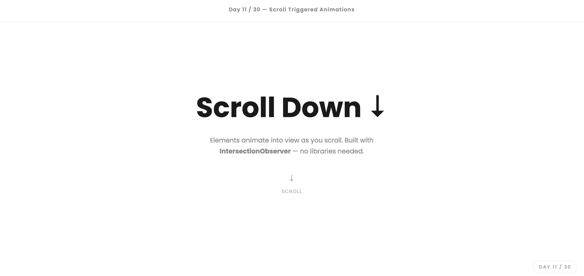

# Day 11 — Scroll Triggered Animations

## Challenge

Make elements animate into view as the user scrolls down the page using IntersectionObserver.

## What I Built

- Full scrollable page with 4 sections
- 4 animation types: `fade-up`, `fade-left`, `fade-right`, `zoom-in`
- Staggered delays using `delay-1` through `delay-5` classes
- Cards, stats, two-column layout, and feature list — all animated on scroll
- Bouncing scroll hint arrow in the hero
- **Zero animation libraries** — pure CSS transitions + 10 lines of JS

## Concepts Used

- `IntersectionObserver` — watches when elements enter the viewport
- `threshold: 0.1` — triggers when 10% of the element is visible
- `observer.unobserve(el)` — stops watching after the animation fires once
- `opacity: 0` + `transform` — elements start hidden and off-position
- `transition: opacity 0.6s, transform 0.6s` — CSS does the actual animation
- `.visible` class — JS adds this one class; CSS handles everything else
- `transition-delay` — staggers child elements so they animate one by one

## Time Taken

~55 minutes

## What I Learned

`IntersectionObserver` is the modern way to detect when elements scroll into view — much better than the old `window.addEventListener('scroll', ...)` approach which fired hundreds of times per second. The pattern is simple: CSS hides the element and defines the transition, JS just adds one class. `observer.unobserve(el)` is important — once the animation has played, there's no reason to keep watching that element.

---

[⬅️ Day 10](../Day-10-Animated-CSS-Loader-Pack/) · [Back to Main README](../README.md) · [Day 12 ➡️](../Day-12-Multi-Step-Form/)