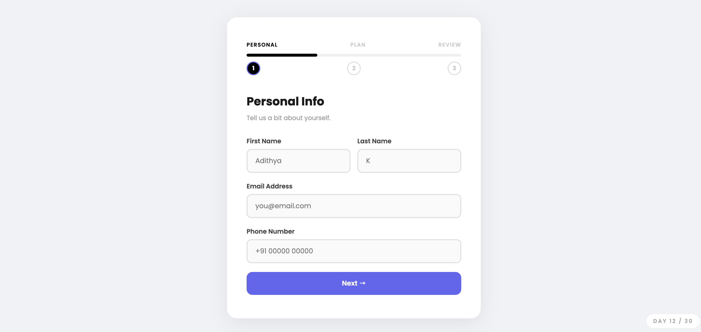
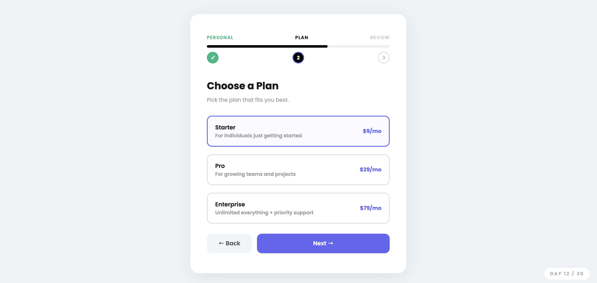

# Day 12 — Multi Step Form

## Challenge

Build a multi-step form that breaks a long form into smaller steps with a progress bar.

## What I Built

- **3-step form** — Personal Info → Choose Plan → Review & Confirm
- **Progress bar** fills up as you move through steps
- **Step dots** turn green with a ✓ when a step is completed
- **Validation on Step 1** — First name, last name, and email are required. Email is checked with a regex pattern. Red border + error message appears if invalid
- **Plan selector** — 3 radio-button style cards (Starter / Pro / Enterprise), selected plan highlights in purple
- **Summary page** — shows all entered details before final submit
- **Success screen** — confirms submission with a 🎉 icon
- **Start Over** button resets everything
- Slide-in animation when switching between steps
- Fully responsive

## Concepts Used

- `display: none` / `display: block` — shows and hides steps
- `@keyframes stepIn` — slide-in animation when a new step appears
- `transition: width 0.4s` — smooth progress bar fill
- `classList.add / remove` — toggles `active` and `done` states
- `document.querySelector('input[name="plan"]:checked').value` — reads selected radio button
- Regex `/^[^\s@]+@[^\s@]+\.[^\s@]+$/` — validates email format
- `input.addEventListener('input', ...)` — clears error as user types
- `element.textContent` — fills the summary page dynamically

## Time Taken

~65 minutes

## What I Learned

A multi-step form is really just one page with multiple `
` panels where only one is visible at a time. The trick is a `goTo(step)` function that hides the current panel and shows the next one. Validation runs before moving forward — if it fails, you just `return` early and don't change the step. The progress bar width is stored in a simple object `{ 1: '33%', 2: '66%', 3: '100%' }` and updated with `style.width`.

---

[⬅️ Day 11](../Day-11-Scroll-Triggered-Animations/) · [Back to Main README](../README.md) · [Day 13 ➡️](../Day-13-CSS-Only-Accordion-FAQ/)