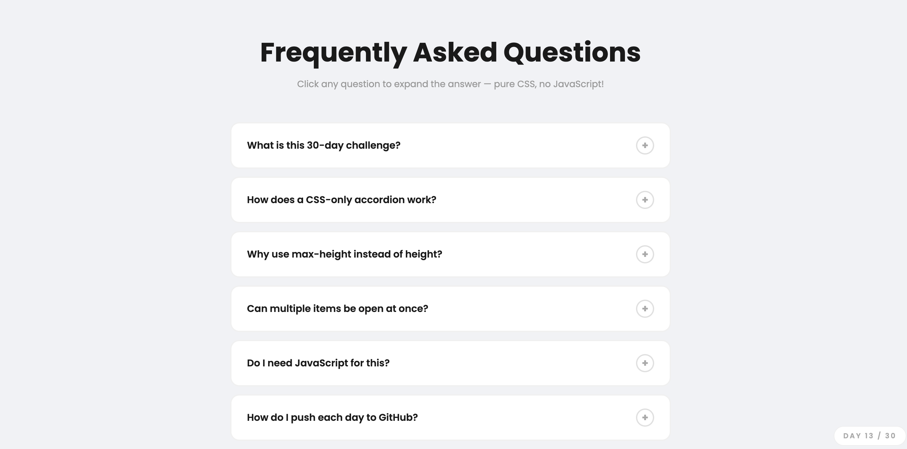
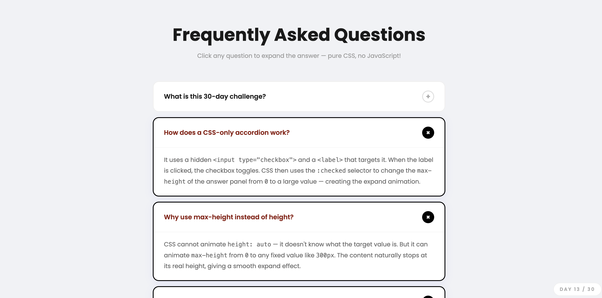

# Day 13 — CSS Only Accordion FAQ

## Challenge

Build an accordion FAQ where questions expand and collapse — using zero JavaScript.

## What I Built

- 6 FAQ items that expand and collapse on click
- **Zero JavaScript** — pure CSS + HTML only
- Multiple items can be open at the same time
- Open item highlights with a purple border and glow
- Question text turns purple when expanded
- **+** icon rotates 45° into an **×** when open
- Smooth expand / collapse animation using `max-height`
- Fully responsive

## Concepts Used

- `<input type="checkbox">` hidden with `display: none` — the toggle state
- `<label for="id">` — clicking the label checks/unchecks the hidden input
- `:checked` pseudo-class — detects when the checkbox is on
- `~` (general sibling selector) — targets elements AFTER the checked input
- `max-height: 0` → `max-height: 300px` — the expand animation trick
- `transition: max-height 0.4s ease` — smooth open/close
- `transform: rotate(45deg)` — turns + into × on the icon
- `overflow: hidden` — hides content when `max-height` is 0

## Time Taken

~35 minutes

## What I Learned

The whole trick is the CSS sibling selector `~`. When you write `input:checked ~ .accordion-item`, it means "find the `.accordion-item` that comes after a checked input". This lets CSS react to state changes without any JavaScript. The `max-height` trick exists because CSS can't animate `height: auto` — but it can animate between two fixed values, so `0` to `300px` works perfectly.

---

[⬅️ Day 12](../Day-12-Multi-Step-Form/) · [Back to Main README](../README.md) · [Day 14 ➡️](../Day-14-Parallax-Scrolling-Page/)