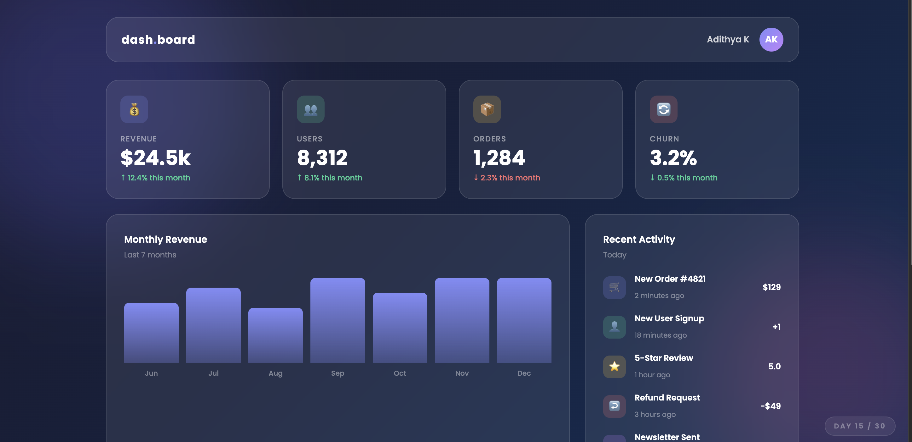

# Day 15 — Glassmorphism Dashboard

## Challenge

Build a dashboard UI using the glassmorphism design style — frosted glass cards over a gradient background.

## What I Built

- Full dashboard layout with topbar, stat cards, chart, activity feed, progress bars, and quick actions
- **Glassmorphism effect** — semi-transparent frosted glass cards
- Coloured blobs in the background (CSS `::before` / `::after` with blur)
- **Bar chart** built with plain HTML divs + JavaScript (no chart library)
- 4 stat cards with revenue, users, orders, and churn
- Recent activity list with icons and amounts
- 4 progress bars with different colours for quarterly goals
- Quick action buttons grid
- Responsive — 4 cols → 2 cols → 1 col on mobile

## Concepts Used

- `backdrop-filter: blur(16px)` — the core glassmorphism effect (frosted glass)
- `background: rgba(255,255,255,0.08)` — semi-transparent white background
- `border: 1px solid rgba(255,255,255,0.12)` — subtle white border for glass edge
- `filter: blur(80px)` — blurs the coloured background blobs
- `CSS Grid` — `repeat(4,1fr)`, `1fr 340px`, `1fr 1fr` for different layout zones
- `Math.max(...array)` — finds the tallest bar for percentage calculation
- `(value / max) * 100 + '%'` — converts data values to bar heights
- `::before` / `::after` — creates two decorative blobs without extra HTML

## Time Taken

~70 minutes

## What I Learned

Glassmorphism needs three CSS properties working together: `backdrop-filter: blur()` for the frosted effect, a semi-transparent `background` (using `rgba`), and a faint `border` to define the glass edge. It only looks good over a colourful background — a plain white page won't show the effect. The bar chart is just `div` elements with `height` set as a percentage of the maximum value — no library needed for simple charts.

---

[⬅️ Day 14](../Day-14-Parallax-Scrolling-Page/) · [Back to Main README](../README.md) · [Day 16 ➡️](../Day-16-Animated-SVG-Icon-Set/)