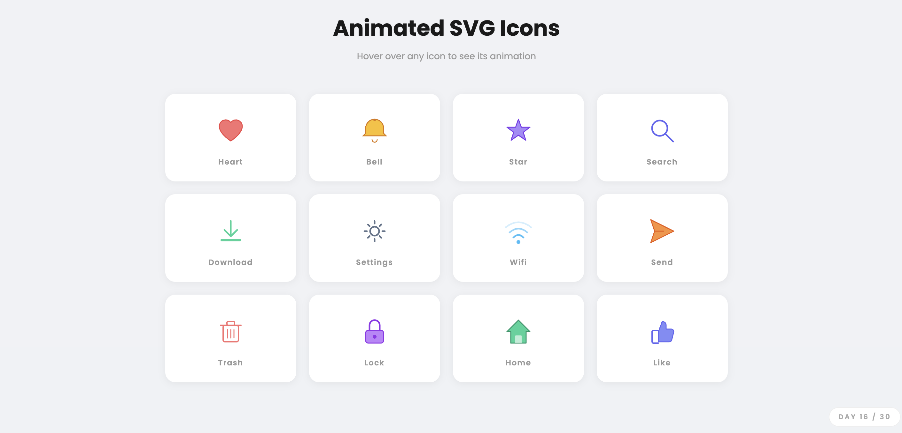

# Day 16 — Animated SVG Icon Set

## Challenge

Build a set of SVG icons that animate on hover using only CSS animations.

## What I Built

12 hand-drawn SVG icons, each with a unique hover animation:

| Icon | Animation |
|------|-----------|
| Heart | Double heartbeat pulse |
| Bell | Left-right swing |
| Star | Continuous spin |
| Search | Bounce up |
| Download | Arrow bounces down |
| Settings | Gear rotates |
| Wifi | Waves pulse in sequence |
| Send | Flies up-right |
| Trash | Shake left-right |
| Lock | Shackle swings open |
| Home | Pop and settle |
| Like | Thumb lifts up |

## Concepts Used

- **SVG elements** — `<path>`, `<circle>`, `<rect>`, `<polygon>`, `<line>`, `<polyline>`
- `viewBox="0 0 52 52"` — defines the SVG coordinate system
- `transform-origin` — sets the pivot point for rotation/scale animations
- `animation-delay` — staggers the wifi wave pulses
- `animation-direction: alternate` — bounces animations back and forth
- `animation: name duration timing infinite` — runs animations forever on hover
- `@keyframes` — defines animation steps with `transform`, `opacity`
- `.icon-card:hover .icon-element` — CSS targets child SVG elements on parent hover
- `animation-play-state: paused / running` — pauses wifi waves when not hovering

## Time Taken

~65 minutes

## What I Learned

SVG uses its own coordinate system defined by `viewBox`. All shapes — circles, rectangles, paths, polygons — are drawn with coordinates inside that space. CSS animations work exactly the same on SVG elements as on HTML elements. The key trick for hover animations is `.card:hover .icon-element` — when the parent card is hovered, the CSS targets the child SVG element inside it to start the animation.

---

[⬅️ Day 15](../Day-15-Glassmorphism-Dashboard/) · [Back to Main README](../README.md) · [Day 17 ➡️](../Day-17-Real-Time-Character-Counter/)