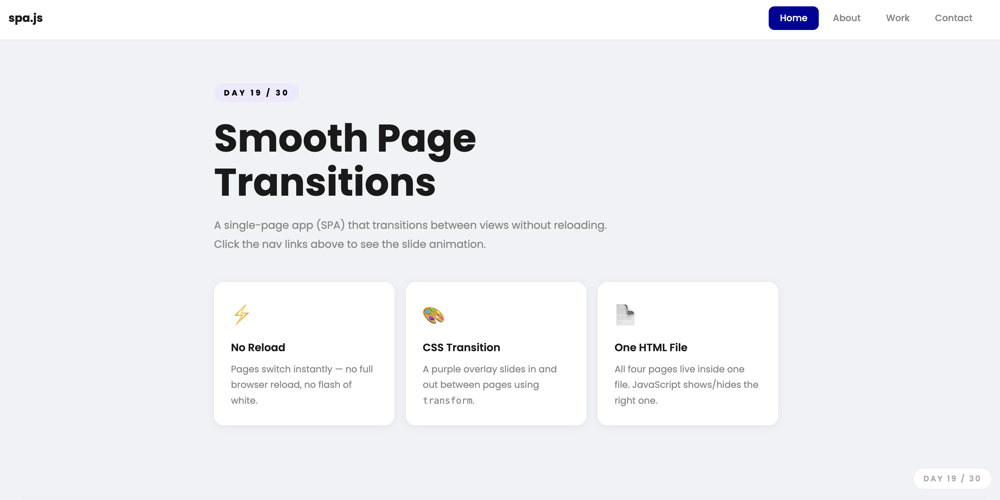
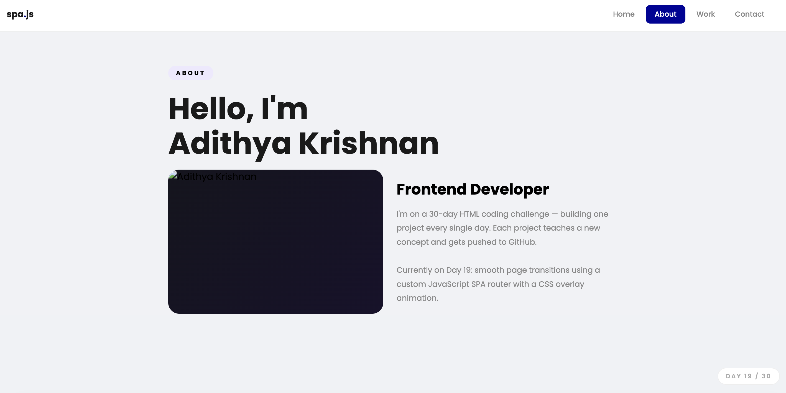
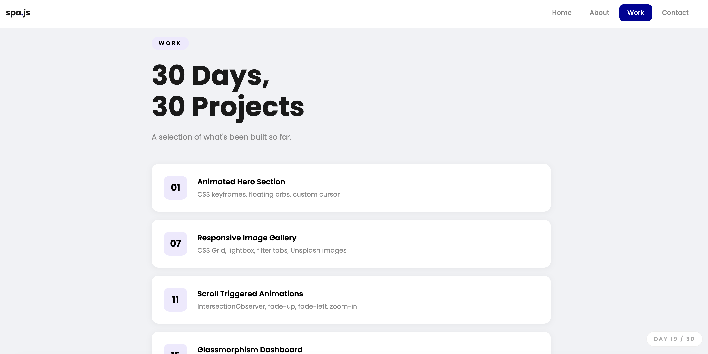
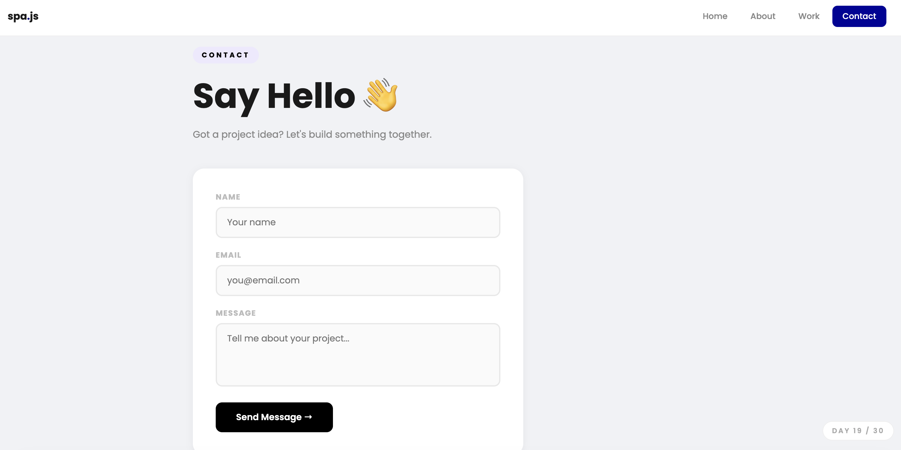

# Day 19 — Smooth Page Transition SPA

## Challenge

Build a single-page app (SPA) with smooth animated transitions between pages — no reloads.

## What I Built

- 4 pages — **Home / About / Work / Contact** — all in one HTML file
- **Purple overlay** slides in from the bottom, page swaps, then overlay exits to the top
- Active nav link highlights in purple
- `animating` flag prevents clicking during a transition
- Each page fades + slides up when it becomes active
- Home page has 3 feature cards
- About page has a two-column layout
- Work page shows 5 projects from the challenge
- Contact page has a working form layout
- Fully responsive

## Concepts Used

- **SPA pattern** — all pages live in the DOM, only one has `.active` at a time
- `opacity: 0; pointer-events: none` → `opacity: 1; pointer-events: all` — shows/hides pages
- `transform: translateY(16px)` → `translateY(0)` — page slides up on entrance
- **Overlay transition trick:**
  1. `.slide-in` — overlay moves from `translateY(100%)` to `translateY(0)` — covers screen
  2. Swap the active page while overlay blocks the view
  3. `.slide-out` — overlay moves from `translateY(0)` to `translateY(-100%)` — reveals new page
- `setTimeout()` — waits for CSS transition to finish before swapping pages
- `cubic-bezier(0.76,0,0.24,1)` — snappy easing curve for the overlay
- `animating` boolean — locks navigation during a transition to prevent glitches

## Time Taken

~60 minutes

## What I Learned

The overlay trick is the key — instead of trying to animate two pages at the same time (messy), you slide an overlay in to hide the swap, change the page underneath while it's invisible, then slide the overlay away to reveal the new page. `setTimeout` syncs JS with CSS transition timing. The `animating` flag is essential — without it, fast clicks during a transition break the page state completely.

---

[⬅️ Day 18](../Day-18-CSS-Grid-Layout-Builder/) · [Back to Main README](../README.md) · [Day 20 ➡️](../Day-20-CSS-Art-Flat-Scene/)