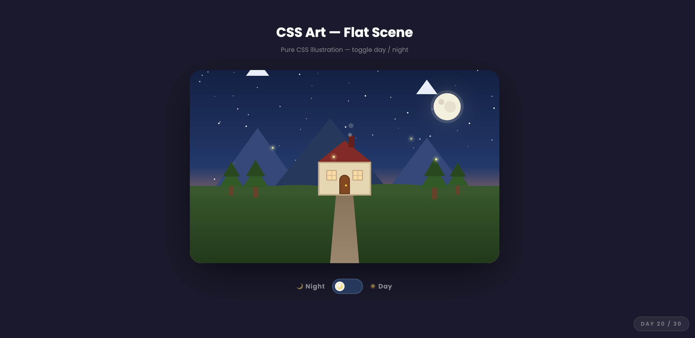
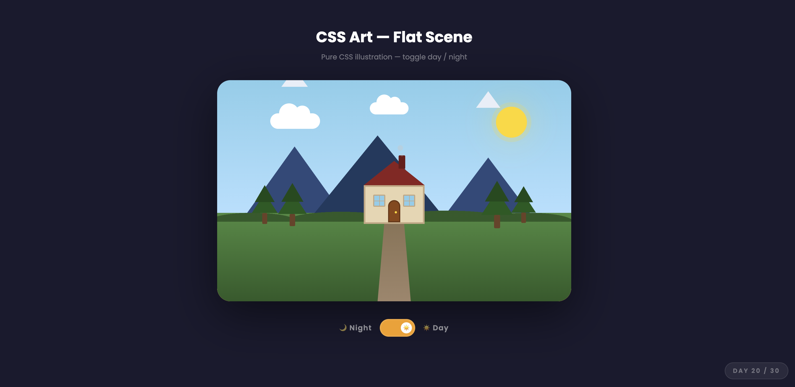

# Day 20 — CSS Art: Flat Scene

## Challenge

Draw a complete flat illustration using only CSS — no images, no SVG, no canvas.

## What I Built

A full day/night landscape scene made entirely from CSS shapes:

**Scene elements:**
- 🌙 **Moon** with craters (CSS `::before` pseudo-element)
- ☀️ **Sun** with glow effect that replaces the moon on toggle
- ⭐ **60 randomly placed stars** with twinkling animation (JS generated)
- ☁️ **2 animated clouds** that float left and right
- 🏔️ **3 mountains** with snow caps using CSS triangles (`border` trick)
- 🌲 **4 pine trees** made from layered triangles and a rectangle trunk
- 🏠 **House** with roof, chimney, windows, door and animated smoke
- 🛤️ **Perspective path** using `clip-path: polygon()`
- 🌿 **Grass ground** with rounded bumps
- 🪲 **5 fireflies** that float and glow at night

**Day/Night toggle:**
- Sky gradient changes from night blue to sunset orange to day blue
- Stars fade out, clouds appear, sun replaces moon
- Windows lose their warm glow in daylight

## Concepts Used

- `border` trick for triangles — `border-width: 0 55px 44px 55px` with transparent sides
- `::before` / `::after` — adds details (snow caps, craters, window crossbars, door knob)
- `clip-path: polygon()` — creates the perspective path trapezoid
- `radial-gradient` — ground grass bumps
- `classList.toggle('day', boolean)` — switches the entire scene with one class
- `box-shadow` — moon glow, sun glow, firefly glow, window warmth
- `@keyframes` for: twinkling stars, floating clouds, drifting smoke, flying fireflies
- `animation-delay` — staggers smoke puffs and fireflies
- JS loop to generate 60 random star elements with random positions and sizes

## Time Taken

~75 minutes

## What I Learned

CSS triangles use a clever border trick — set all borders to transparent except one, and a triangle appears. `clip-path: polygon()` is much easier for non-right-angle shapes like the path trapezoid. The day/night toggle is just one class on the parent `.scene` — every child element uses `.scene.day .child` selectors to change its own appearance, so the toggle itself is just one line of JS.

---

[⬅️ Day 19](../Day-19-Smooth-Page-Transition-SPA/) · [Back to Main README](../README.md) · [Day 21 ➡️](../Day-21-Custom-Video-Player/)