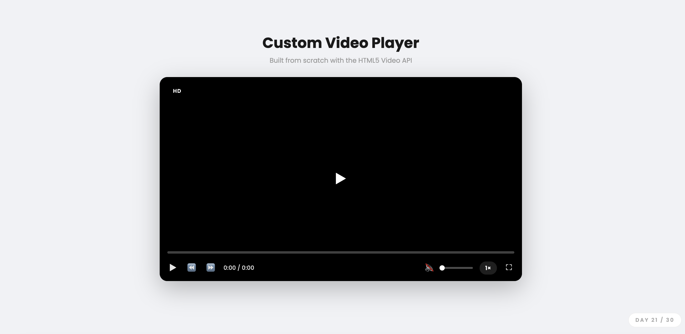

# Day 21 — Custom Video Player

## Challenge

Build a fully custom video player UI using the HTML5 Video API — replacing the default browser controls.

## What I Built

- Custom play/pause button (center overlay + bottom bar)
- **Seekable progress bar** — click or drag to jump to any point
- **Buffered progress** indicator (lighter bar showing loaded video)
- **Rewind / Forward 10s** buttons
- **Volume slider** + mute toggle with dynamic icon (🔇 🔉 🔊)
- **Playback speed menu** — 0.5× to 2×, with a badge showing current speed
- **Fullscreen toggle**
- **Live time display** — `0:42 / 3:15` format
- **Keyboard shortcuts**:
  - `Space` — play/pause
  - `←` / `→` — seek 5s back/forward
  - `↑` / `↓` — volume up/down
  - `M` — mute
  - `F` — fullscreen
- Controls fade in on hover, fade out while playing
- Fully responsive

## Concepts Used

- **HTML5 Video API**: `video.play()`, `video.pause()`, `video.currentTime`, `video.duration`, `video.volume`, `video.muted`, `video.playbackRate`
- Events: `play`, `pause`, `timeupdate`, `progress`, `loadedmetadata`
- `video.buffered.end()` — gets how much of the video has loaded
- `getBoundingClientRect()` — converts mouse X position into a percentage for seeking
- `document.requestFullscreen()` / `exitFullscreen()` — native fullscreen API
- `e.target.closest('.speed-wrap')` — detects clicks outside a menu to close it
- `padStart(2, '0')` — formats seconds as `05` instead of `5`
- CSS `aspect-ratio: 16/9` — keeps the player in standard video proportions

## Time Taken

~80 minutes

## What I Learned

The `<video>` element exposes a rich JavaScript API — `currentTime`, `duration`, `volume`, `playbackRate` are all readable AND writable properties, so building custom controls is just reading/writing these values. The progress bar seek works by converting a mouse click's X position into a percentage of the bar's width, then multiplying by `video.duration` to get the target time. `video.buffered` is a `TimeRanges` object — `.end(lastIndex)` gives how many seconds have loaded so far.

---

[⬅️ Day 20](../Day-20-CSS-Art-Flat-Scene/) · [Back to Main README](../README.md) · [Day 22 ➡️](../Day-22-Infinite-Marquee-Ticker/)